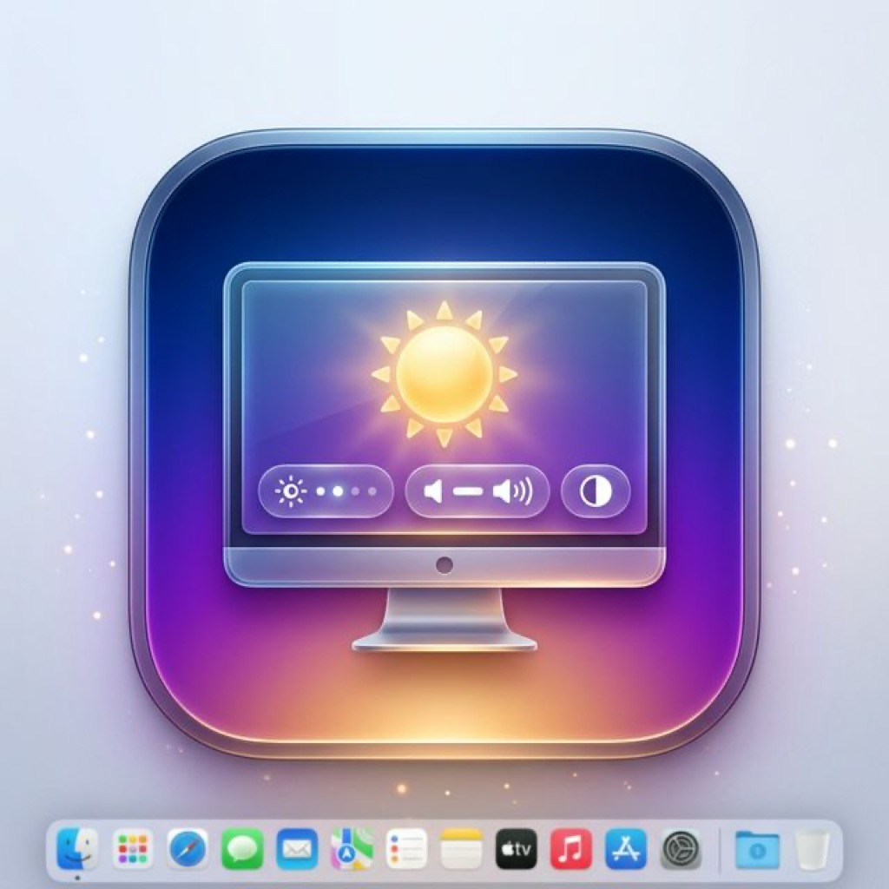
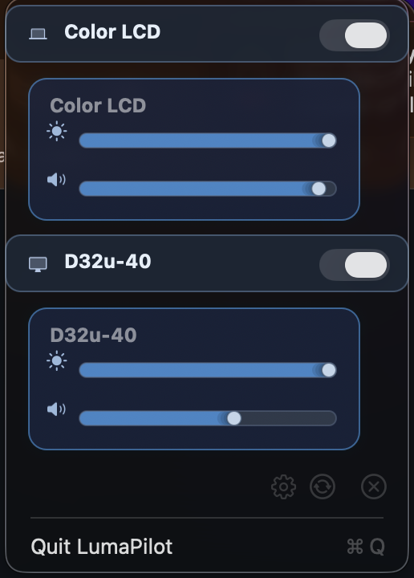
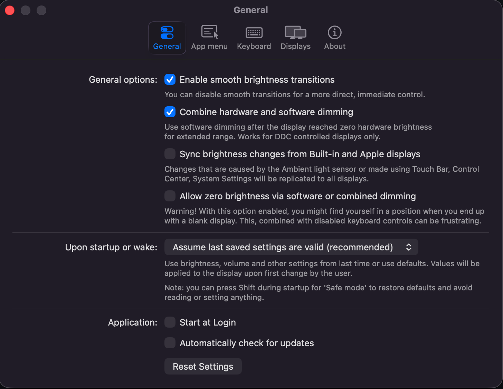

<div align="center">
  
  <h1>LumaPilot</h1>
  <p><b>Controls your external display brightness and volume and shows native OSD.</b></p>
  <p>Use menubar sliders, Apple media keys, or Option+number shortcuts to turn displays off and back on.</p>
  
  <a href="https://github.com/Achyut198/LumaPilot/releases"></a>
  <a href="https://github.com/Achyut198/LumaPilot/releases"></a>
  <a href="https://github.com/Achyut198/LumaPilot/blob/main/License.txt"></a>
</div>

<hr>

## 🌟 About LumaPilot

LumaPilot is proudly built upon the incredible open-source foundation of [MonitorControl](https://github.com/MonitorControl/MonitorControl), combining its robust hardware-level DDC architecture with critical modern enhancements specially designed for stability in professional macOS environments. 

## ✨ Latest Features

* **Option+Number Display Toggles:** Use `Option+1`, `Option+2`, `Option+3`, and so on to toggle the matching monitor off or back on. `Option+0` maps to display 10.
* **Stable Monitor Shortcut Mapping:** Disabled monitors stay in the shortcut list, so pressing the same shortcut can bring the same external display back instead of shifting to another display.
* **Adaptive Menu Bar Icon:** The menu bar icon now follows macOS template rendering, appearing light on dark menu bars and dark on light menu bars.
* **Updated Latest Build:** The current rolling DMG and GitHub Release are published as `v4.3.10`.

**Exclusive LumaPilot Additions:**
* **Persistent Display Tracking:** Rebuilt the `DisplayManager` engine to permanently memorize disabled monitors—even after entirely rebooting your Mac.
* **Robust Login Auto-Start:** Integrated rigorous `SMAppService` validation hooks to permanently eliminate silent background crashes that plagued standard macOS Auto-Start capabilities.
* **Full-Screen Space Overlays:** Forced LumaPilot's software dimming (`shade`) to dynamically persist continuously across all active full-screen virtual spaces—your dimming no longer gets accidentally deactivated by full-screen Safari/YouTube windows!
* **HiDPI Retina Tagging:** Programmatically filters system graphics configurations and explicitly identifies true `(HiDPI)` modes within your resolution list, preventing unintended clarity and fuzziness degradation.
* **Resilient Privilege Check:** Solved persistent accessibility permission loops caused by native macOS TCC cached binary miscounts.

## 🚀 Key Features

* **Brightness & Volume Control**: Adjust your external and internal display's brightness, volume, and contrast seamlessly.
* **Native OSD Integration**: Displays the native Apple OSD for brightness and volume changes.
* **Display Toggle**: Turn off and turn on displays (both internal and external monitors).
* **Option+Number Shortcuts**: Toggle displays directly with `Option+1` through `Option+9`, plus `Option+0` for display 10.
* **Keyboard & Menubar**: Control your displays via the unobtrusive menubar sliders or using standard Apple keyboard media keys.
* **Automated Sync**: Synchronize brightness from built-in ambient light sensors across all external screens.
* **Smooth Transitions**: Enjoy fluid, smooth brightness adjustments.
* **Custom Shortcuts**: Set up custom keyboard combos simply from the settings.

## 📸 Screenshots

### Menu UI



### General Settings



## 💾 Installation

Download the latest build (`v4.3.10` or newer):

- [Latest DMG](https://raw.githubusercontent.com/Achyut198/LumaPilot/main/dist/LumaPilot-latest-macOS.dmg)
- [Latest SHA-256](https://raw.githubusercontent.com/Achyut198/LumaPilot/main/dist/LumaPilot-latest-macOS.dmg.sha256)
- [Latest release page](https://github.com/Achyut198/LumaPilot/releases/latest)
- [All releases](https://github.com/Achyut198/LumaPilot/releases)

Then open the `.dmg` and drag **LumaPilot.app** into **Applications**.

### Install via Command Line (Recommended)

You can also install LumaPilot using a single command:

```bash
curl -L -o /tmp/LumaPilot.dmg https://raw.githubusercontent.com/Achyut198/LumaPilot/main/dist/LumaPilot-latest-macOS.dmg && \
curl -L -o /tmp/LumaPilot.dmg.sha256 https://raw.githubusercontent.com/Achyut198/LumaPilot/main/dist/LumaPilot-latest-macOS.dmg.sha256 && \
EXPECTED="$(awk '{print $1}' /tmp/LumaPilot.dmg.sha256)" && \
ACTUAL="$(shasum -a 256 /tmp/LumaPilot.dmg | awk '{print $1}')" && \
[ "$EXPECTED" = "$ACTUAL" ] && \
MOUNT="$(hdiutil attach /tmp/LumaPilot.dmg -nobrowse | awk '/\/Volumes\// {print substr($0, index($0, "/Volumes/")); exit}')" && \
rm -rf /Applications/LumaPilot.app && \
rsync -a --delete "$MOUNT/LumaPilot.app/" "/Applications/LumaPilot.app/" && \
hdiutil detach "$MOUNT" && \
xattr -dr com.apple.quarantine /Applications/LumaPilot.app && \
open /Applications/LumaPilot.app
```

## 🔐 Gatekeeper & Safety

Current public build is unsigned, so macOS may show:
**"Apple could not verify 'LumaPilot' is free of malware..."**

If that happens, install safely with:
1. Right click `LumaPilot.app` in Applications
2. Click `Open`
3. Click `Open` again in the security prompt

Fallback terminal method:

```bash
xattr -dr com.apple.quarantine /Applications/LumaPilot.app
open /Applications/LumaPilot.app
```

If needed, you can also allow it from:
`System Settings -> Privacy & Security -> Open Anyway`.

This repository includes:
- `scripts/macos_notarized_release.sh` for local notarized DMG builds
- `.github/workflows/release-notarized-dmg.yml` for tag-based CI release uploads

## 🛠 Usage Instructions

1. Launch **LumaPilot** from your Applications folder.
2. Grant **Accessibility Permissions** (System Settings » Privacy & Security) to enable native keyboard shortcuts interactions.
3. Access control sliders from the menubar brightness icon at the top of your screen.
4. Use `Option+1`, `Option+2`, `Option+3`, etc. to toggle monitors off and on by their display order.
5. Explore **Settings** for deeper customization regarding external display behaviors.

## 💻 Compatibility & Requirements

* **macOS 11 Big Sur** or newer is recommended for optimal performance.
* **macOS Sequoia / Tahoe** requires v4.3.3 or newer.
* Supports most modern external LCD displays (USB-C, DisplayPort, HDMI) using the standard DDC/CI protocol, alongside built-in Apple displays.
* DisplayLink, Airplay, and Sidecar supported via shade control.

## 📄 Credits

Built and maintained by the **LumaPilot team**. Please see `License.txt` for details.
